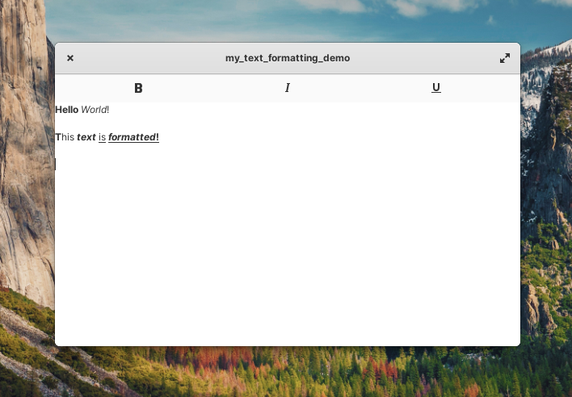
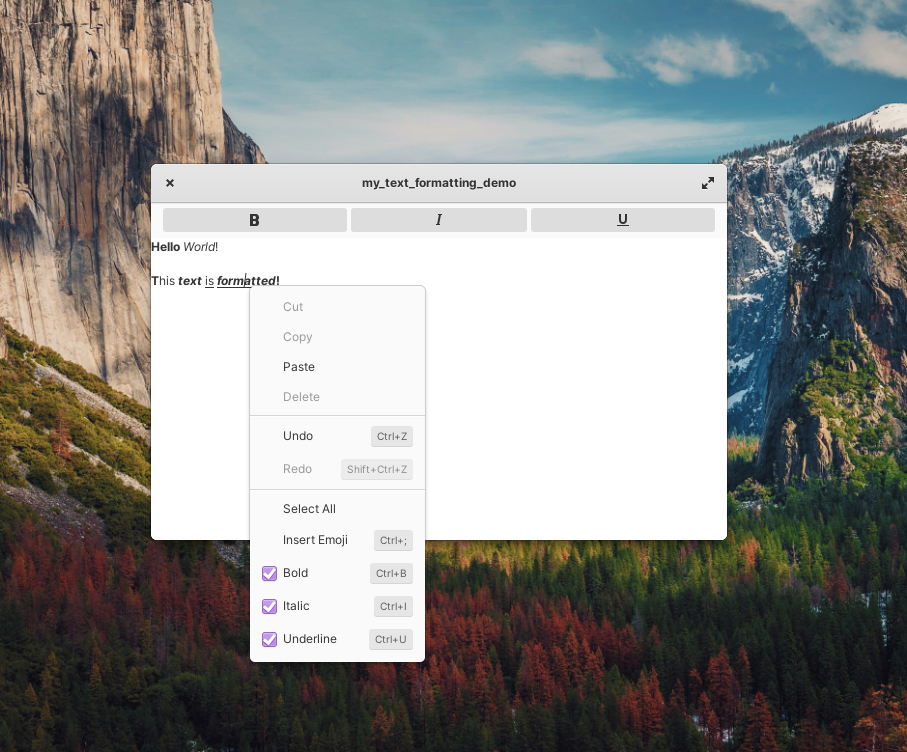

# text_formatting

An app that demonstrates how to create a GTK4 app with text formatting features.

Features:

- Logic of making text bold, italic and/or underlined
- Implements actions and binds them to action buttons
- Keyboard shortcuts for executing text formatting actions.
- Keeping formatting action states in sync based on caret (text cursor) position.
- Adding extra formatting menu to menu items in `Gtk.TextView` context menu
- And more...





## Build instructions:

```Bash
$ meson build
$ ninja -C build
$ build/text_formatting
```

## How to store my formatted text data

You can retrieve the text using the `text` field in `Gtk.TextBuffer` or with `get_text()` however
the formatting is stored in the text buffer's tag table. Here's a block of code you can use to get the data you need
for each tag:

```vala
this.text_buffer.tag_table.foreach ((tag) => {
    Gtk.TextIter start;
    this.text_buffer.get_start_iter (out start);

    do {
        if (!start.starts_tag (tag)) continue;

        Gtk.TextIter begin = start.copy ();
        start.forward_to_tag_toggle (tag);

        print ("Tag name: %s\n", tag.name);
        print ("Tag start location: %d\n", begin.get_offset ());
        print ("Tag end location: %d\n", start.get_offset ());
        print ("\n");
    } while (start.forward_to_tag_toggle (tag));
});
```

You could adapt the block of code above to store the tag data in a list and use that with the text from the text buffer
to store the formatted text data in any data format you desire.

For an example of an app that does this in production, see Sticky Notes (Note: It's written in TypeScript): https://github.com/vixalien/sticky

## Resources Used

- GTK 4 Text Widget Overview - https://docs.gtk.org/gtk4/section-text-widget.html
- GTK 4 Documentation - https://docs.gtk.org/gtk4/
- GTK 4 Widget Fatory Demo - https://gitlab.gnome.org/GNOME/gtk/-/tree/main/demos/widget-factory
- Valadoc.org - https://valadoc.org
- Sticky Notes App - https://github.com/vixalien/sticky
